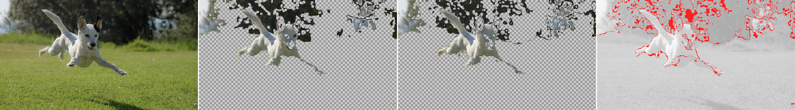

# 35 — Supervised colour separation: the region graph makes a cheap rule clean

**Question.** Report 33 concluded that the format "does not help you decide what the background is". That was tested with an *unsupervised* flood — seed from the border, absorb neighbours within a drifting RGB tolerance — and it failed on both substrates. The obvious objection: that is a bad algorithm, not a verdict on the representation. If a user supplies colour information — *this is grass, remove it; this is the dog, keep it* — does colour separate them, and does the region graph help?

**Answer. Yes on both counts, with one hard limit.** Chromatic separation works cleanly once examples are supplied. The region graph makes the same rule **140–249× cheaper** and **3.5–5.9× less fragmented**, and the cleanliness gap *widens* as the classifier sharpens. What colour cannot do is separate a black ear from dark foliage, and no substrate fixes that.

Data: [`35-background-removal-supervised-data.txt`](35-background-removal-supervised-data.txt). Verb: `lab bgclass`. Images: [`35-bgclass/`](35-bgclass/).

## The change from report 33

Everything is held identical except the selection rule.

| | report 33 | this report |
|---|---|---|
| rule | flood from border, drifting RGB tolerance | **1-nearest-neighbour over supplied examples** |
| space | RGB | **CIELAB** |
| supervision | none | a few points the user touches |

CIELAB matters: a shadowed white hair and a sunlit blade of grass are close in RGB *magnitude* and far apart perceptually. That is exactly the confusion that sank the flood.

Both arms run the **identical** classifier on the **identical** examples. The only variable is what gets classified — our region colours, or the rival's decoded pixels.

## It works

*Source | per-region cut | per-pixel cut | disagreement in red. The grass is gone and the dog is intact — the thing report 33 could not do at any tolerance.*

Mask agreement between the two arms rises from **61.55%** under the flood to **91.96–95.40%** under supervision. Both substrates now largely agree, because the rule is finally right.

**Report 33's pessimism was about the algorithm, not the representation.** That correction belongs on the record.

## The region graph wins twice

| run | arm | decisions | total blobs |
|---|---|---|---|
| dog, 8 examples | **region** | **1,229** | **75** |
| | pixel | 305,532 | 263 |
| dog, 18 examples | **region** | **1,229** | **77** |
| | pixel | 305,532 | 451 |
| bobcat, 15 examples | **region** | **1,433** | **144** |
| | pixel | 199,995 | 535 |

**Cost:** 140–249× fewer decisions. A region has one colour, so classifying the image means classifying ~1,200 things instead of ~300,000.

**Cleanliness, and this is the better finding:** "blobs" counts connected components of each mask value — a proxy for how much morphological cleanup the mask needs. Sharpening the dog classifier from 8 to 18 examples removed 45,081 more background pixels and:

- per-**pixel** blobs went **263 → 451** (+71%)
- per-**region** blobs went **75 → 77** (flat)

**A sharper decision boundary fragments a pixel mask and does not fragment a region mask.** The partition regularises the decision spatially for free, so there is nothing to clean up afterwards. On the bobcat the subject itself comes out as **11 connected pieces on the region graph against 191 on the pixel grid**, from the same classifier.

That is a property of the representation, not of the classifier, and it is the first measured capability win in this study that is not about bytes.

## The hard limit, stated plainly

Colour cannot separate things that are the same colour. The dog's black ear is `rgb(42,44,39)`; the foliage behind it runs `rgb(10,16,16)` to `rgb(54,60,60)`. The bobcat's dark markings sit inside the range of its own blurred background. So the dog cut keeps part of the tree line, and the bobcat cut has holes in the animal.

**No set of colour examples fixes this, on either substrate.** It is exactly the residue a learned model buys: iOS Lift Subject uses shape and semantics, not a colour lookup. This report does not claim to match it and did not test against it.

The honest division of labour that follows:

- **Deciding *what* to select needs semantics.** Colour gets you the chromatic majority; the achromatic collisions need a model.
- **Executing the selection is where this format is strong** — 140–249× cheaper, 3.5–5.9× cleaner, and edge-exact because the boundary is stored rather than inferred.

And those compose: a model that outputs *region labels* rather than a pixel mask inherits the cheapness and the exact edges. **The 140–249× is what makes an expensive model affordable to run per-region.**

## Caveats

- **Two images**, one subject type: a centred animal on a natural background.
- **Examples were hand-picked by the author while looking at the picture.** A real gesture supplies one touch point, not seven. How this degrades with fewer or worse examples is untested, and it is the first thing to measure next.
- **Blobs measure fragmentation, not accuracy.** There is no ground-truth mask for these images, so nothing here is an accuracy claim.
- **No comparison against rembg, SAM or Lift Subject.** Still the honest next comparison, and still not run.
- Both arms sit downstream of a lossy encode: our partition at the capability mark, WebP at matched fidelity.
