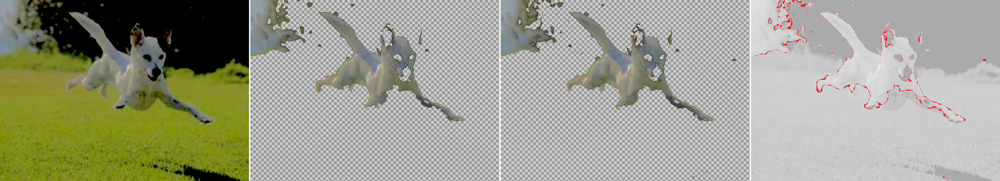

# 36 — Boosting colour separation before the cut: it works, and it shrinks our advantage

**Question.** Report 35 found the hard limit of a colour rule: it cannot separate things that *are* the same colour, so the dog's dark ear stayed with the dark foliage. The owner's proposal: pre-process the image to push the classes apart first, then run the same pipeline. Does it work?

**Answer. Yes, clearly — and it is the pixel arm that benefits most.** Every number improves, the two substrates nearly stop disagreeing (98.86%), and the region graph's advantage narrows from 5.9× to 2.9× on fragmentation and from 1.35× to 1.11× on edge fidelity. The boost also **introduced a collision the original did not have**, by clipping.

Data: [`36-preprocess-data.txt`](36-preprocess-data.txt). Images: [`36-preprocess/`](36-preprocess/). Script: [`code/runs/35-bgclass.sh`](code/runs/35-bgclass.sh).

## The transform, and which knob did what

Supplied by the owner after the run, intent stated as **noise reduction**:

| adjustment | effect here |
|---|---|
| Highlights −100 | flattens the bright end — helps |
| Contrast −100 | compresses the tonal range, reduces texture variance — **helps most** |
| Brightness −20 | darkens overall — neutral |
| **Black point +100** | **crushes the dark end to pure black — this is the clipping** |

**Three of the four are doing the good work and one is doing all the damage.** Highlights, contrast and brightness flatten the image, which reduces texture variance — and texture variance is exactly what shatters grass into many drifting-colour regions (report 33). Black point +100 is what mapped both the background *and* the dog's nose to `rgb(0,0,0)`.

That makes the fix specific rather than speculative: **keep the first three, drop or reduce the fourth.**

## The cut is much better

*Source | per-region cut | per-pixel cut | disagreement in red. Grass and sky both gone cleanly. Note the holes in the dog's face.*

| | original dog | **pre-processed** |
|---|---|---|
| arms agree | 94.50% | **98.86%** |
| region blobs | 77 | **22** |
| pixel blobs | 451 | **63** |
| region edge dE | 5.47 | **10.88** |
| pixel edge dE | 4.04 | **9.82** |

The mechanism is visible in the probed colours: the boost drove grass's **blue channel down to 8–58** while the dog's blue still tracks its green at **100–142**. The blue channel alone now discriminates. That is a real gain and it is what the proposal predicted.

## But it shrinks the format's advantage

| | original | **pre-processed** |
|---|---|---|
| blobs, region vs pixel | 5.9× | **2.9×** |
| edge dE, region vs pixel | 1.35× | **1.11×** |

With the majority-filter steelman on both arms it narrows further, and at radius 7 **the pixel arm is ahead on edge fidelity** (9.54 vs 9.38).

**The mechanism is worth stating plainly, because it generalises.** The region graph's advantage was largely that it *regularises an error-prone classifier*. Make the classifier reliable and there is less left to regularise. Cleanly separated colour classes are precisely what makes a per-pixel decision reliable — so the better the preprocessing, the less the partition adds.

That does not make the preprocessing a bad idea. It makes it a *substrate-independent* one: it is the single biggest improvement measured in this line of work, and most of it is available to anyone, with or without this format.

## The collision it introduced

Probed from the pre-processed frame:

| | colour |
|---|---|
| background sky and trees, four points | `rgb(0,0,0)` |
| **the dog's nose and eyes** | **`rgb(0,0,0)`** |

**Exactly equal.** The boost clipped both to pure black.

In the original these were separable *in principle* — the ear was `rgb(42,44,39)` against foliage at `rgb(10,16,16)`–`rgb(54,60,60)`: overlapping, but not identical. Clipping made the collision total. It is why the cut above has holes where the dog's eyes, nose and mouth should be.

**The boost traded one collision for another.** It gained the chromatic axis and destroyed the luminance axis.

## What to try next

**A non-clipping transform.** The gain came from chroma — stretching the classes apart in hue and saturation. The loss came from crushing the luminance endpoints. Those are independent axes, so the gain should be available without the loss: raise chroma separation, leave the endpoints intact, keep dark-dog and dark-background distinguishable.

**Untested.** Stated as the next experiment, not as a result. With the settings now known it is concrete: re-run at **Black point 0**, everything else unchanged, and check whether the dog's face survives while the grass separation holds.

### The bigger hypothesis hiding in "I tried to reduce noise"

Noise reduction may help *this format specifically*, on bytes, for a structural reason. **79.3% of our file is boundary** (report 34), boundary count is driven by texture, and texture is largely noise. A transform codec's cost is driven by coefficient energy instead. So denoising might lower our bill more than it lowers WebP's.

**Against that, a precedent on the killed list:** report 04 killed foveation/CSF as "real (−71%) but codec-agnostic preprocessing that lowers the wall for every codec equally". Denoising could be the same class.

The two arguments point opposite ways, which is exactly when to measure rather than assume: denoise one corpus, encode both arms from the denoised source, and see whose bill falls further. **This is the first byte-side idea in a while that is not already closed**, and it is cheap. It is not run here.

There is also a version of this that is *native* to the format rather than a preprocess: the merge already computes region colours, so a per-image chroma stretch could be fitted from the region palette and stored in the header as a colour-space tag — which SHPC still lacks (`HANDOFF.md`, H2). That would make the transform reversible and free rather than a destructive edit to the source. Also untested, and it should be, because a destructive preprocess is a bad thing to require of an asset pipeline.

## Caveats

- **One image, one preprocessing setting**, applied by hand outside this pipeline. The settings are known (above) but were applied in an external editor, so the exact transfer curves are not reproducible from this repo — an already-processed JPEG was supplied.
- **Different crop and size** from report 33's original (738×539 vs 738×414), so the two are not pixel-comparable. The comparison is between summary statistics, not matched runs.
- **The first attempt put two "keep" points on grass.** Caught by reading the printed RGB values before trusting the output, which is why the probe step now exists in the script.
- **Bytes are unchanged as a story**: 8,908 B against WebP's 5,562 B at matched fidelity, +60.2%. Not what this report is about.
