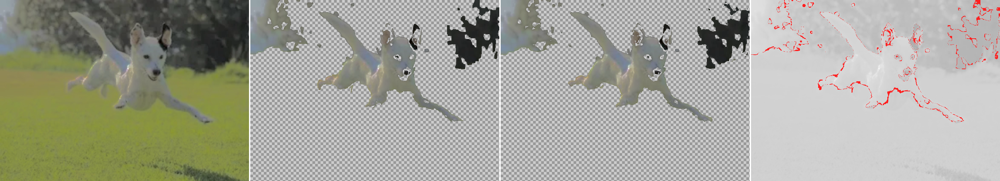

# 37 — Segment one image, colour from another

**Question.** The owner's proposal: *flatten the colours so the difference is more obvious, get the shape, then apply it to the original.* This format can do that natively — geometry and colour are **separate chunks** in the file, so nothing requires them to come from the same pixels. A raster codec cannot: its segmentation is the block grid and its colours are the same coefficients. Does it help?

**Answer. For a mask, yes and it is free. For the file, no — badly.** −10.82 dB for −10.80% bytes. And removing the black point, which caused report 36's clipping, **moves the error rather than removing it**.

Data: [`37-crosseg-data.txt`](37-crosseg-data.txt). Verb: `lab crosseg`.

## For the file: negative, and not close

Segmentation from the black-point version, colours from the version without it. Same crop, same size, PSNR measured against the colour source in **both** rows:

| partition from | regions | PSNR | wall B | col B | total B |
|---|---|---|---|---|---|
| flattened (**cross**) | 1,296 | **28.44** | 9,220 | 3,188 | 12,409 |
| original (baseline) | 1,141 | **39.27** | 11,181 | 2,731 | 13,911 |

**−10.82 dB to save 10.80% of the bytes.** A catastrophic trade.

**Mechanism.** The flattened source has crushed blacks, so its partition puts the background trees and the dog's dark features in the *same* regions. Filling those from the original averages over colours the original keeps distinct.

**The rule this establishes:** the partition must match the colours it is going to carry. Segmenting on a different image is only free when you are **throwing the fill away** — that is, when you want a mask, not a picture.

## For the mask: free, and it is the good version of the idea

Geometry is shared, so a mask is just a set of region ids. Classify using the **flattened** image's region colours (easy separation), then apply that id set to the **original** pixels. Costs nothing extra, keeps the real colours, and needs no second encode.

That is exactly the proposal, and it works — subject to the collision below.

## Removing the black point moves the error, it does not remove it

*Source | per-region cut | per-pixel cut | disagreement. The dog's face is intact now — and a large block of dark trees came with it.*

| probe | with black point +100 | **without** |
|---|---|---|
| dog nose | `rgb(0,0,0)` | `rgb(38,37,36)` |
| background sky | `rgb(0,0,0)` | `rgb(64,68,62)` |
| background trees | `rgb(0,0,0)` | `rgb(57,55,51)` |

Clipping is gone. But `38,37,36` against `57,55,51` is a ~20-unit gap, and the dark trees sit inside the dog's dark range.

- **With black point:** trees removed, **the dog's face holed** — its nose and eyes *were* the background colour.
- **Without black point:** face intact, **a large block of dark trees kept**.

**Same collision, relocated.** The dark-dog/dark-tree overlap is a property of the *scene*. The black point made it total; removing it makes it merely severe. No colour rule resolves it in either direction — which is report 35's hard limit, unchanged.

## A methodological correction to report 36

Report 36 tabulated edge dE **across two different images** (original 5.47 → pre-processed 10.88) and read the rise as better mask quality. **That comparison is confounded and is withdrawn.**

Edge dE is a mean CIELAB step across the mask edge, so it scales with the image's own contrast. Black point +100 raises contrast at the dark end, inflating dE whether or not the mask improved. Confirmed here: the no-black-point version is *flatter* and scores **2.59 / 2.13** against the black-point version's **10.88 / 9.82** — a 4× difference driven by the tone curve.

**Edge dE is valid between arms on one image**, which is how the region-vs-pixel claim uses it. It is **not** valid across images. Report 36's within-image ratios (1.35× original, 1.11× pre-processed) stand.

## Where this leaves the idea

The useful half survives and is now specific:

1. **Flatten to help the classifier, keep the mask, discard the flattened pixels.** Free here because geometry and colour are separate chunks. Do not ship the flattened image and do not build the file from its partition.
2. **Flatten without clipping** — the black point is the one knob to leave alone.
3. **But do not expect it to solve the achromatic collision.** That needs the thing colour cannot supply, which is what report 35 already concluded and what iOS Lift Subject actually uses.

## Caveats

- **One scene, two tone curves**, one region count each.
- The baseline lands at 1,141 regions against the cross arm's 1,296 — `runRD` stops at the first mark at or below target and the two sources coarsen differently. The cross arm has **more** regions and still scores 10.82 dB worse, so the direction is safe.
- Both tone curves were applied in an external editor; the transfer curves are not reproducible from this repo.
